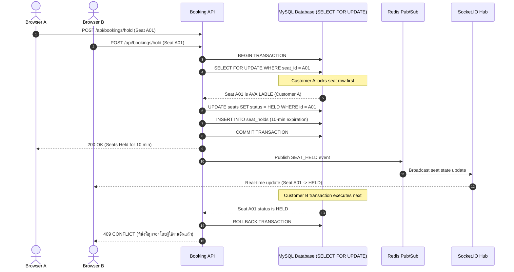
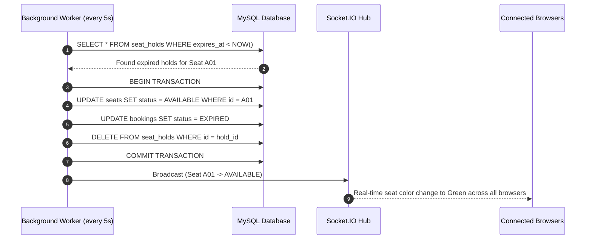
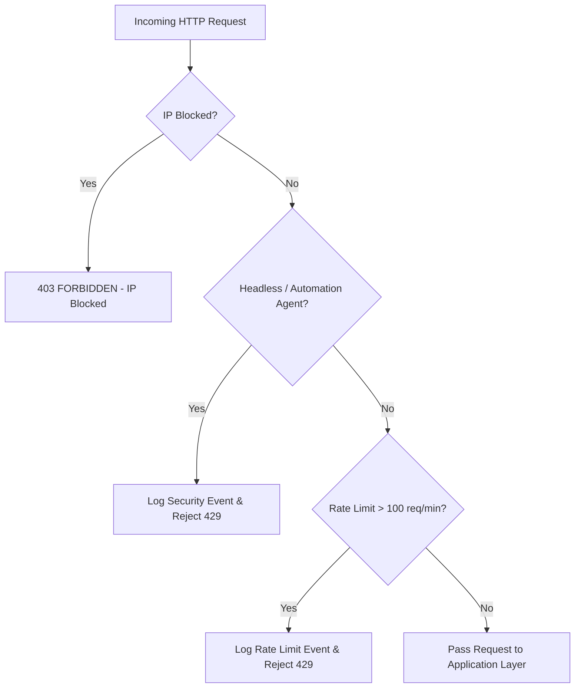

# System Architecture & Component Design

## Overview
The **Online Concert Ticketing System** is designed using a Layered & Modular Architecture capable of handling high-concurrency ticket sales (500+ TPS).

```mermaid
graph TD
    Client[Browser Desktop / Tablet / Mobile] --> |HTTP / WSS| WebApp[Next.js App / API Server]
    
    subgraph Presentation Layer
        CustomerPortal[Customer Portal]
        AdminDashboard[Admin Dashboard]
    end

    subgraph Application Layer
        AuthService[Auth & RBAC Service]
        QueueService[Virtual Queue FIFO Service]
        BookingService[Seat Booking Engine]
        PaymentService[Simulated Payment Gateway]
        TicketService[E-Ticket & QR/PDF Engine]
        AntiBotService[Anti-Bot & Security Service]
        AdminService[Admin Analytics & Audit Service]
    end

    subgraph Real-Time & Worker Layer
        SocketEngine[WebSocket / Socket.IO Hub]
        BackgroundWorker[Seat Hold Expiration Worker]
    end

    subgraph Database & Infrastructure Layer
        MySQL[(MySQL Relational DB)]
        Redis[(Redis Cache / Queue / PubSub)]
    end

    WebApp --> Presentation Layer
    Presentation Layer --> Application Layer
    Application Layer --> Real-Time & Worker Layer
    Application Layer --> Database & Infrastructure Layer
```

## Core Flows

### 1. Concurrent Double-Booking Prevention Flow


### 2. 10-Minute Reservation Timer Expiration Flow


### 3. Anti-Bot Verification Flow

