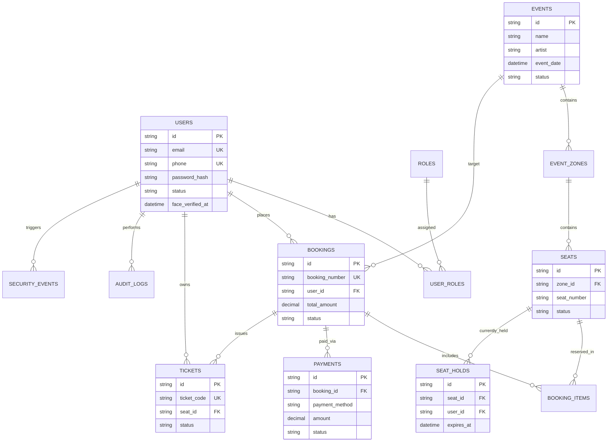

# Data Model & ER Diagram Documentation

## Entity Relationship Diagram (Mermaid ERD)

## Primary Key, Foreign Key & Unique Indexes
- `users`: Primary Key `id`, Unique Index on `email`, `phone`, `uuid`.
- `user_roles`: Composite Unique Index `[user_id, role_id]`.
- `seats`: Composite Unique Index `[zone_id, seat_number]`.
- `seat_holds`: Unique Index on `hold_token`. Foreign Keys to `seats(id)`, `users(id)`, `bookings(id)`.
- `bookings`: Unique Index on `booking_number`.
- `tickets`: Unique Index on `ticket_code`.
